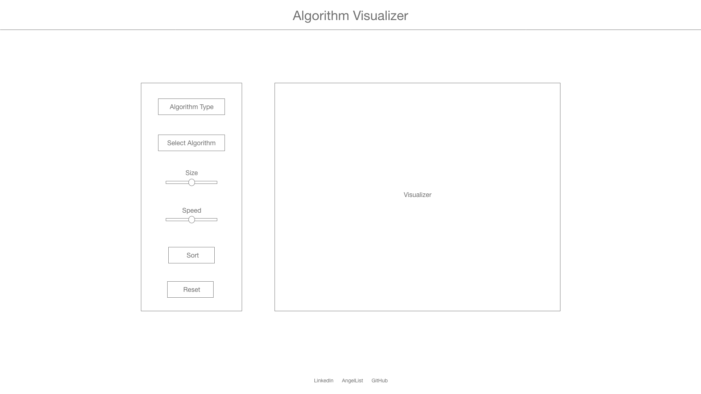

## Overview

The Algorithm Visualizer allows users to see how different algorithms 
work under the hood.

## Instructions 

Select the type of algorithm from the dropdown menu, set the size of the graph and speed to visualize. Once all the these are set click the Sort button and watch the algorithm come to life. 
Click the Reset button to generate a newly randomized graph.

Demo

https://karlfleener.github.io/algorithm-visualizer/

## Functionality and MVP

* Users can choose from a selection of sorting algorithms to visualize
* Users can increase/decrease amount of elements to sort
* Users can increase/decrease the sorting time
* Users can Reset/Randomize elements

## Wireframes

## Architecture and Technologies

* JavaScript for algorithm logic
* Canvas for graphs and animation
* Browserify to bundle js files

## Timeline

Day 1 - Setup all necessary Node modules and getting webpack up and running. Create basic entry file and begin to write the logic for each algorithm.

Day 2 - Finish algorithm logic and implement styling/animation logic. Begin adding functionality for # of elements and speed sliding scales.

Day 3 - Learn Canvas and finish adding animations.

Day 4 - Style the frontend, making it polished and professional.

Day 5 - 

## Bonus/Future
* Continue adding sorting algorithms
* Add pathfinding algorithms
* Increase amount of ways to visualize
